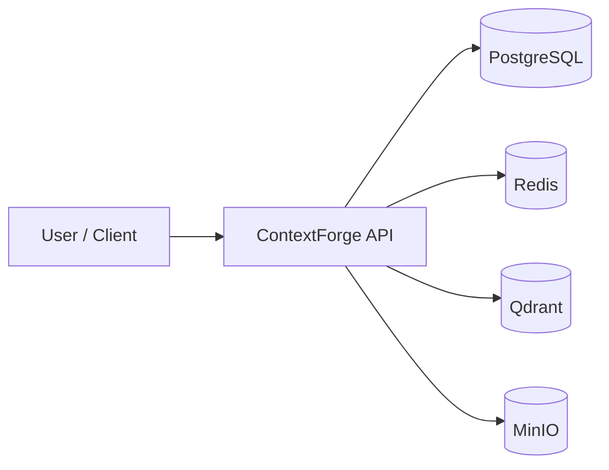
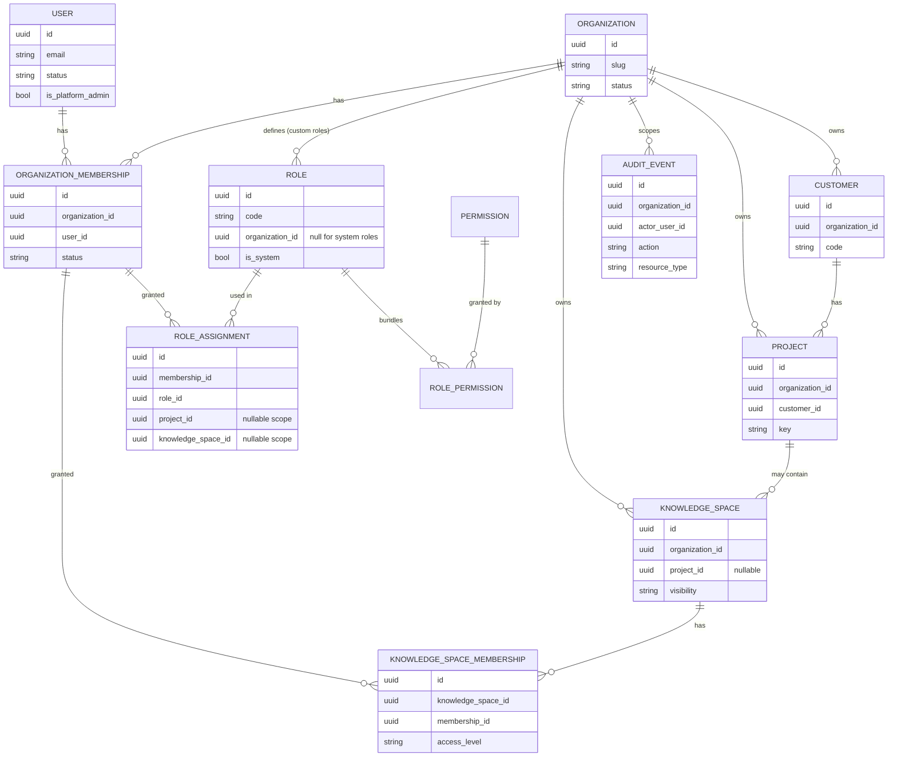
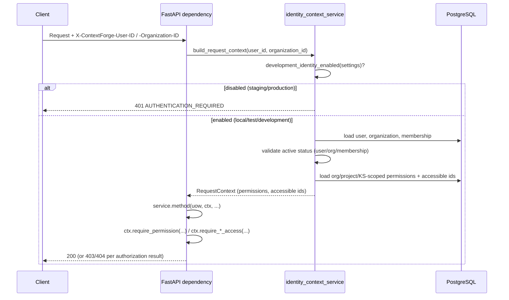

# ContextForge — Multilingual Enterprise Knowledge Assistant

Secure enterprise knowledge platform foundation where organizations will upload project
documents, technical documentation, support records, API specifications, architecture
documents, and operational guides. Users will later ask questions in Turkish or English
and receive answers grounded in authorized company documents.

> **Current scope:** this repository commit establishes a production-oriented backend
> foundation with identity, multi-tenancy, RBAC, and audit logging. Document ingestion,
> embeddings, RAG, LLM integration, and chat are **not** implemented yet.
>
> **Authentication:** identity in this commit is resolved via development-only HTTP
> headers (see [Development identity headers](#development-identity-headers)), gated off
> entirely in `staging`/`production`. It is **not** a substitute for real authentication
> (OIDC/SSO) — see [Auth roadmap](#auth-roadmap).

## Long-term product vision

* Upload and govern enterprise documents
* Enforce authorization boundaries over knowledge
* Retrieve grounded context from approved sources
* Answer questions in Turkish and English
* Provide auditability and operational visibility

## Current scope

* FastAPI application factory and lifespan
* Modular Clean Architecture layout
* Async PostgreSQL + SQLAlchemy 2 + Alembic
* Redis, Qdrant, and MinIO infrastructure wiring
* Health, readiness, and system info endpoints
* Structured logging and correlation IDs
* Docker / Docker Compose
* **Organization multi-tenancy** — organizations, memberships, and every business
  entity scoped by `organization_id` (see [ADR-005](docs/adr/ADR-005-organization-multi-tenancy.md))
* **Scoped RBAC** — system + custom roles, permissions, org/project/knowledge-space-scoped
  role assignments (see [ADR-006](docs/adr/ADR-006-scoped-rbac.md))
* **Development identity** — header-based caller identity for local/test/development
  only (see [ADR-007](docs/adr/ADR-007-development-identity.md))
* **Customers, projects, and knowledge spaces** — core tenant business entities, with
  knowledge-space visibility rules (`organization` vs `restricted`)
* **Append-only audit trail** — every mutation is durably recorded with sanitized
  metadata (see [ADR-008](docs/adr/ADR-008-append-only-audit.md))
* Pytest (unit, integration, architecture, authorization, security, API)
* Ruff, mypy, pre-commit, GitHub Actions CI

## Architecture overview



Conceptual layers:

* **API** — HTTP transport, middleware, schemas
* **Application** — use cases and ports
* **Domain** — entities and domain errors
* **Infrastructure** — PostgreSQL, Redis, Qdrant, MinIO adapters

## Identity & multi-tenancy overview

Every business entity in ContextForge is scoped to an **organization** (the tenant
boundary). A **user** can be a member of multiple organizations; each
`OrganizationMembership` is where roles are actually assigned, and where authorization
for a given request is resolved from.



Request-scoped authorization flow (see [ADR-007](docs/adr/ADR-007-development-identity.md)
for the identity part and [ADR-006](docs/adr/ADR-006-scoped-rbac.md) for RBAC):



## Technology stack

| Area | Choice |
| --- | --- |
| Language | Python 3.13 |
| API | FastAPI + Uvicorn |
| Settings | pydantic-settings |
| DB | PostgreSQL + SQLAlchemy 2 + asyncpg + Alembic |
| Cache / coordination | Redis |
| Vector store (future) | Qdrant |
| Object storage (future docs) | MinIO |
| Packaging | uv |
| Quality | Ruff, mypy, pytest, pre-commit |

## Repository structure

```text
src/contextforge/     Application source
migrations/           Alembic migrations
tests/                Unit, integration, architecture tests
infrastructure/       Docker/service helper assets
docs/                 Architecture docs and ADRs
scripts/              Entrypoint and utility scripts
```

## Prerequisites

* Python 3.13
* [uv](https://docs.astral.sh/uv/)
* Docker and Docker Compose
* GNU Make (optional but recommended)

## Local installation

```bash
cp .env.example .env
make install
```

## Docker Compose startup

```bash
docker compose up --build
```

This starts:

* `api` on http://localhost:8000
* `postgres` on localhost:5432
* `redis` on localhost:6379
* `qdrant` on localhost:6333
* `minio` on localhost:9000 (console on 9001)
* one-shot `migrate` and `minio-init` jobs

API docs (local/development): http://localhost:8000/docs

Stop:

```bash
make down
# or
docker compose down
```

## Environment variables

See `.env.example`. Nested settings use:

```text
CONTEXTFORGE_APP__ENVIRONMENT
CONTEXTFORGE_POSTGRES__HOST
CONTEXTFORGE_REDIS__URL
CONTEXTFORGE_QDRANT__URL
CONTEXTFORGE_MINIO__ENDPOINT
```

Supported environments: `local`, `test`, `development`, `staging`, `production`.

Docker Compose uses clearly marked **non-production** development credentials.

## Development identity headers

> ⚠️ **This is not production authentication.** It is a deliberate, environment-gated
> stand-in used only in `local`, `test`, and `development` (see
> [ADR-007](docs/adr/ADR-007-development-identity.md)). It is unconditionally disabled in
> `staging` and `production` — every request without real authentication is rejected
> with `401 AUTHENTICATION_REQUIRED` in those environments, regardless of headers sent.

Every authenticated endpoint resolves "who is calling, and on behalf of which
organization" from two request headers:

```text
X-ContextForge-User-ID: <uuid of an existing, active user>
X-ContextForge-Organization-ID: <uuid of an organization the user is an active member of>
```

Both are validated against the database on every request (user active, organization not
archived, membership active) — a syntactically valid but nonexistent/inactive id is
rejected the same as a missing header. There is no `X-ContextForge-Role` or
`X-ContextForge-Permissions` header — permissions are always computed server-side from
`RoleAssignment` rows; any role/permission header a client sends is simply ignored (see
`tests/security/test_role_headers_ignored.py`).

## `bootstrap-dev`

`make bootstrap-dev` seeds a deterministic local development tenant — safe to run
repeatedly (idempotent: looks up each entity by its natural key before creating it, and
produces the exact same UUIDs every time via `uuid5`):

```bash
make migrate         # apply migrations first
make bootstrap-dev
```

It creates:

* organization `contextforge-dev`
* an `organization_admin` user (`admin@contextforge.local`) and a `developer` user
  (`developer@contextforge.local`), both active members
* a customer (`DEV-CUST`) and a project (`DEMO`) linked to it
* an organization-visible knowledge space (`company-handbook`) and a `restricted` one
  (`incident-playbooks`), with the developer granted `contributor` access to the
  restricted space

It prints the header values for the seeded admin user at the end:

```text
X-ContextForge-User-ID: <admin uuid>
X-ContextForge-Organization-ID: <org uuid>
```

Paste those into the `curl` examples below, or into the `Authorize`-adjacent headers of
`/docs`, to call the API as that user. `make seed-system-data` is a separate, read-only
sanity check that the RBAC permission/system-role reference catalog (seeded by migrations,
not by this script) is actually present, and prints their counts.

## Database migrations

```bash
make migrate                 # alembic upgrade head
make migration name="desc"   # autogenerate revision
make downgrade               # alembic downgrade -1
uv run alembic history
```

Compose applies migrations through the dedicated `migrate` service before the API starts.

## Test commands

```bash
make test
make test-unit
make test-integration
make test-architecture
make test-authorization
make test-security
make coverage
```

Integration tests expect local infrastructure (Compose) to be reachable on the default ports.
`test-authorization` and `test-security` run the `authorization`- and `security`-marked
suites under `tests/unit/authorization/` and `tests/security/` respectively (plus any other
test marked accordingly); `tests/api/` is marked `api` and exercised as part of `make test`.

## Lint and type-check

```bash
make lint
make format
make type-check
```

## API endpoints

| Method | Path | Purpose |
| --- | --- | --- |
| GET | `/api/v1/health/live` | Liveness (no infra dependency) |
| GET | `/api/v1/health/ready` | Readiness for PostgreSQL, Redis, Qdrant, MinIO |
| GET | `/api/v1/system/info` | Safe system metadata and capability flags |
| POST/GET | `/api/v1/organizations`, `/{id}`, `/{id}/suspend`, `/{id}/archive` | Organization lifecycle |
| POST | `/api/v1/users`, `/{id}`, `/{id}/suspend`, `/{id}/archive` | User provisioning/lifecycle |
| POST/GET/DELETE | `/api/v1/memberships`, `/{id}`, `/{id}/suspend` | Organization membership lifecycle |
| GET/POST/PATCH/DELETE | `/api/v1/roles`, `/{id}`, `/assignments`, `/assignments/{id}` | Roles and role assignments |
| POST/GET/PATCH | `/api/v1/customers`, `/{id}`, `/{id}/archive` | Customer lifecycle |
| POST/GET/PATCH | `/api/v1/projects`, `/{id}`, `/{id}/archive` | Project lifecycle |
| POST/GET/PATCH | `/api/v1/knowledge-spaces`, `/{id}`, `/{id}/archive` | Knowledge space lifecycle |
| POST/GET/PATCH/DELETE | `/api/v1/knowledge-spaces/{id}/memberships`, `/{ks_membership_id}` | Knowledge-space membership |
| POST/GET/PATCH/PUT/DELETE | `/api/v1/documents`, `/{id}`, `/{id}/content`, `/{id}/download` | Document upload, metadata, content replace, download, delete |
| GET | `/api/v1/audit` | Query the append-only audit trail (`audit:read`) |

All endpoints above (except `/health/*` and `/system/info`) require
[development identity headers](#development-identity-headers) and are subject to
[scoped RBAC](docs/adr/ADR-006-scoped-rbac.md).

Example system info capabilities (implemented in this commit vs. still planned):

```json
{
  "identity_context": true,
  "multi_tenancy": true,
  "rbac": true,
  "customers": true,
  "projects": true,
  "knowledge_spaces": true,
  "audit_log": true,
  "document_ingestion": true,
  "document_parsing": true,
  "document_chunking": true,
  "document_embeddings": true,
  "rag": false,
  "chat": false,
  "multilingual_answers": false
}
```

## System roles & permissions summary

Permissions are namespaced `resource:action` strings; system roles are global (identical
across every organization) and cannot be created/modified through the API (see
[ADR-006](docs/adr/ADR-006-scoped-rbac.md)). Organizations can additionally define their
own custom roles with any subset of permissions via `POST /api/v1/roles`.

| System role | Summary |
| --- | --- |
| `platform_admin` | Bypasses every check; set directly on `User.is_platform_admin`, never assigned via the role API |
| `organization_admin` | Every permission below — full control of their organization |
| `project_manager` | Create/manage projects, knowledge spaces, and documents; read customers |
| `knowledge_manager` | Create/manage knowledge spaces and documents; read customers/projects |
| `developer` | Read-only: customers, projects, knowledge spaces; create/read/update documents (no delete) |
| `support_agent` | Read-only: customers, projects, knowledge spaces, documents |
| `viewer` | Read-only: customers, projects, knowledge spaces, documents |

| Permission | Meaning |
| --- | --- |
| `organization:read`, `organization:update`, `organization:manage_members` | Organization details and membership |
| `user:read`, `user:manage` | Users within a shared organization |
| `role:read`, `role:manage` | Custom roles and role assignments |
| `customer:create/read/update/archive` | Customers |
| `project:create/read/update/archive/manage_members` | Projects |
| `knowledge_space:create/read/update/archive/manage_members` | Knowledge spaces |
| `document:create/read/update/delete` | Documents |
| `audit:read` | The audit trail |

Every user can always read/update their *own* profile (`GET`/`PATCH /users/{their own id}`)
without holding `user:read`/`user:manage`.

## Knowledge-space visibility

Knowledge spaces have two visibility levels:

* **`organization`** (default) — visible to anyone in the organization holding
  `knowledge_space:read`. No explicit grant needed.
* **`restricted`** — requires an *explicit* grant: either a knowledge-space-scoped role
  assignment, or a `KnowledgeSpaceMembership` row. Holding org-wide `knowledge_space:read`
  is **not** sufficient — even the organization admin who created a restricted space gets
  `404` (not `403`) without an explicit grant, so a caller can never distinguish "exists
  but restricted" from "does not exist" (see
  `tests/security/test_restricted_knowledge_space_access.py`).
* `platform_admin` bypasses both rules.

## Example curl commands

```bash
# Seed a local dev tenant and capture the printed admin headers.
make bootstrap-dev

USER_ID="<admin uuid printed above>"
ORG_ID="<org uuid printed above>"

# System info (no auth required).
curl -s http://localhost:8000/api/v1/system/info | jq

# List organizations the admin is a member of.
curl -s http://localhost:8000/api/v1/organizations \
  -H "X-ContextForge-User-ID: $USER_ID" \
  -H "X-ContextForge-Organization-ID: $ORG_ID" | jq

# Create a customer as the organization admin.
curl -s -X POST http://localhost:8000/api/v1/customers \
  -H "X-ContextForge-User-ID: $USER_ID" \
  -H "X-ContextForge-Organization-ID: $ORG_ID" \
  -H "Content-Type: application/json" \
  -d '{"name": "Acme Corp", "code": "ACME"}' | jq

# Missing identity headers -> 401.
curl -s -o /dev/null -w "%{http_code}\n" http://localhost:8000/api/v1/customers
```

## Auth roadmap

Development identity ([ADR-007](docs/adr/ADR-007-development-identity.md)) is an interim
mechanism only. Planned follow-ups, in rough order:

1. Real authentication (OIDC/SSO) replacing header-based identity, without changing
   `RequestContext` or any application service's signature.
2. Session/token issuance and refresh flows.
3. Per-organization identity provider configuration (enterprise SSO).
4. Service-to-service / API-key authentication for automation clients.
5. Removing development identity from non-production builds entirely once (1)–(2) ship.

Document ingestion, embeddings, RAG, and chat remain out of scope until authentication and
tenancy are considered stable — see the [Planned roadmap](#planned-roadmap) below.

## Health-check behavior

* `/health/live` always checks process liveness only.
* `/health/ready` probes dependencies concurrently with timeouts.
* Any mandatory dependency down → HTTP 503 and `"status": "not_ready"`.
* Responses never include credentials or stack traces.

## Troubleshooting

| Symptom | Likely cause | Fix |
| --- | --- | --- |
| Ready returns 503 | Dependency not healthy | `docker compose ps` and inspect service logs |
| Migrations fail | Postgres not ready | Ensure `postgres` is healthy, rerun `make migrate` |
| MinIO check fails | Bucket missing | Ensure `minio-init` completed successfully |
| Docs missing in prod | Expected | Docs disabled when `CONTEXTFORGE_APP__ENVIRONMENT=production` |

## Security notes

* Do not commit `.env` or secrets.
* Containers run as non-root (`uid 10001`).
* CORS is off unless origins are explicitly configured.
* **Development identity is not production authentication** — it is unconditionally
  disabled in `staging`/`production` (see
  [Development identity headers](#development-identity-headers) and
  [ADR-007](docs/adr/ADR-007-development-identity.md)). Real authentication (OIDC/SSO)
  is tracked in the [Auth roadmap](#auth-roadmap) and has not shipped yet — treat any
  non-production deployment of this API as an internal foundation only.
* Authorization (RBAC + tenancy) is enforced server-side only; no client-supplied
  role/permission header is ever trusted (see
  [ADR-006](docs/adr/ADR-006-scoped-rbac.md)).
* Audit metadata is sanitized to strip secret-like keys before persistence (see
  [ADR-008](docs/adr/ADR-008-append-only-audit.md)).

## Development conventions

* English for code, comments, docs, logs, and commits
* UTC timestamps in the backend
* User-facing timezone conversion will be handled at presentation boundaries later
* No LangChain/LangGraph/LLM SDKs in this foundation commit

## Planned roadmap

1. ~~Multi-tenancy, scoped RBAC, and audit logging~~ — done in this commit (development
   identity only; see [Auth roadmap](#auth-roadmap) for real authentication)
2. Real authentication (OIDC/SSO) replacing development identity
3. Document upload and MinIO ingestion pipeline
4. Chunking, embeddings, and Qdrant indexing
5. Retrieval and grounded answer generation
6. Multilingual chat experience (Turkish / English)
7. Admin tooling on top of the audit trail

## License

MIT — see [LICENSE](LICENSE).

## Architecture decision records

* [ADR-001: Modular Monolith and Clean Architecture](docs/adr/ADR-001-modular-monolith-clean-architecture.md)
* [ADR-002: PostgreSQL as the Transactional Database](docs/adr/ADR-002-postgresql-transactional-database.md)
* [ADR-003: Asynchronous Python Stack](docs/adr/ADR-003-asynchronous-python-stack.md)
* [ADR-004: Qdrant, Redis, and MinIO Infrastructure](docs/adr/ADR-004-qdrant-redis-minio-infrastructure.md)
* [ADR-005: Organization-Scoped Multi-Tenancy](docs/adr/ADR-005-organization-multi-tenancy.md)
* [ADR-006: Scoped Role-Based Access Control (RBAC)](docs/adr/ADR-006-scoped-rbac.md)
* [ADR-007: Header-Based Development Identity](docs/adr/ADR-007-development-identity.md)
* [ADR-008: Append-Only Audit Trail with Sanitized Metadata](docs/adr/ADR-008-append-only-audit.md)
