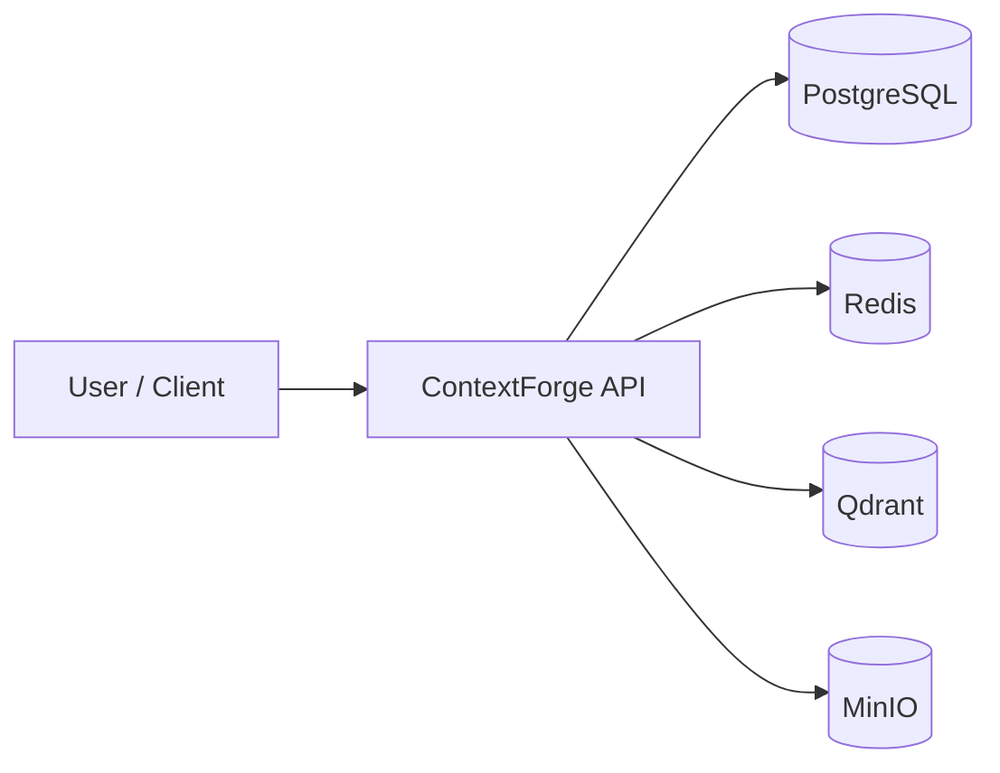

# ContextForge — Multilingual Enterprise Knowledge Assistant

Secure enterprise knowledge platform foundation where organizations will upload project
documents, technical documentation, support records, API specifications, architecture
documents, and operational guides. Users will later ask questions in Turkish or English
and receive answers grounded in authorized company documents.

> **Current scope:** this repository commit establishes a production-oriented backend
> foundation only. Document ingestion, embeddings, RAG, LLM integration, and chat are
> **not** implemented yet.

## Long-term product vision

* Upload and govern enterprise documents
* Enforce authorization boundaries over knowledge
* Retrieve grounded context from approved sources
* Answer questions in Turkish and English
* Provide auditability and operational visibility

## Current first-commit scope

* FastAPI application factory and lifespan
* Modular Clean Architecture layout
* Async PostgreSQL + SQLAlchemy 2 + Alembic
* Redis, Qdrant, and MinIO infrastructure wiring
* Health, readiness, and system info endpoints
* Structured logging and correlation IDs
* Docker / Docker Compose
* Pytest (unit, integration, architecture)
* Ruff, mypy, pre-commit, GitHub Actions CI

## Architecture overview



Conceptual layers:

* **API** — HTTP transport, middleware, schemas
* **Application** — use cases and ports
* **Domain** — entities and domain errors
* **Infrastructure** — PostgreSQL, Redis, Qdrant, MinIO adapters

## Technology stack

| Area | Choice |
| --- | --- |
| Language | Python 3.13 |
| API | FastAPI + Uvicorn |
| Settings | pydantic-settings |
| DB | PostgreSQL + SQLAlchemy 2 + asyncpg + Alembic |
| Cache / coordination | Redis |
| Vector store (future) | Qdrant |
| Object storage (future docs) | MinIO |
| Packaging | uv |
| Quality | Ruff, mypy, pytest, pre-commit |

## Repository structure

```text
src/contextforge/     Application source
migrations/           Alembic migrations
tests/                Unit, integration, architecture tests
infrastructure/       Docker/service helper assets
docs/                 Architecture docs and ADRs
scripts/              Entrypoint and utility scripts
```

## Prerequisites

* Python 3.13
* [uv](https://docs.astral.sh/uv/)
* Docker and Docker Compose
* GNU Make (optional but recommended)

## Local installation

```bash
cp .env.example .env
make install
```

## Docker Compose startup

```bash
docker compose up --build
```

This starts:

* `api` on http://localhost:8000
* `postgres` on localhost:5432
* `redis` on localhost:6379
* `qdrant` on localhost:6333
* `minio` on localhost:9000 (console on 9001)
* one-shot `migrate` and `minio-init` jobs

API docs (local/development): http://localhost:8000/docs

Stop:

```bash
make down
# or
docker compose down
```

## Environment variables

See `.env.example`. Nested settings use:

```text
CONTEXTFORGE_APP__ENVIRONMENT
CONTEXTFORGE_POSTGRES__HOST
CONTEXTFORGE_REDIS__URL
CONTEXTFORGE_QDRANT__URL
CONTEXTFORGE_MINIO__ENDPOINT
```

Supported environments: `local`, `test`, `development`, `staging`, `production`.

Docker Compose uses clearly marked **non-production** development credentials.

## Database migrations

```bash
make migrate                 # alembic upgrade head
make migration name="desc"   # autogenerate revision
make downgrade               # alembic downgrade -1
uv run alembic history
```

Compose applies migrations through the dedicated `migrate` service before the API starts.

## Test commands

```bash
make test
make test-unit
make test-integration
make test-architecture
make coverage
```

Integration tests expect local infrastructure (Compose) to be reachable on the default ports.

## Lint and type-check

```bash
make lint
make format
make type-check
```

## API endpoints

| Method | Path | Purpose |
| --- | --- | --- |
| GET | `/api/v1/health/live` | Liveness (no infra dependency) |
| GET | `/api/v1/health/ready` | Readiness for PostgreSQL, Redis, Qdrant, MinIO |
| GET | `/api/v1/system/info` | Safe system metadata and capability flags |

Example system info capabilities (all `false` in this commit):

```json
{
  "document_ingestion": false,
  "rag": false,
  "chat": false,
  "multilingual_answers": false
}
```

## Health-check behavior

* `/health/live` always checks process liveness only.
* `/health/ready` probes dependencies concurrently with timeouts.
* Any mandatory dependency down → HTTP 503 and `"status": "not_ready"`.
* Responses never include credentials or stack traces.

## Troubleshooting

| Symptom | Likely cause | Fix |
| --- | --- | --- |
| Ready returns 503 | Dependency not healthy | `docker compose ps` and inspect service logs |
| Migrations fail | Postgres not ready | Ensure `postgres` is healthy, rerun `make migrate` |
| MinIO check fails | Bucket missing | Ensure `minio-init` completed successfully |
| Docs missing in prod | Expected | Docs disabled when `CONTEXTFORGE_APP__ENVIRONMENT=production` |

## Security notes

* Do not commit `.env` or secrets.
* Containers run as non-root (`uid 10001`).
* CORS is off unless origins are explicitly configured.
* Authentication arrives in later commits; treat the API as an internal foundation for now.

## Development conventions

* English for code, comments, docs, logs, and commits
* UTC timestamps in the backend
* User-facing timezone conversion will be handled at presentation boundaries later
* No LangChain/LangGraph/LLM SDKs in this foundation commit

## Planned roadmap

1. Authentication and tenancy
2. Document upload and MinIO ingestion pipeline
3. Chunking, embeddings, and Qdrant indexing
4. Retrieval and grounded answer generation
5. Multilingual chat experience (Turkish / English)
6. Audit logging and admin tooling

## License

MIT — see [LICENSE](LICENSE).

## Architecture decision records

* [ADR-001: Modular Monolith and Clean Architecture](docs/adr/ADR-001-modular-monolith-clean-architecture.md)
* [ADR-002: PostgreSQL as the Transactional Database](docs/adr/ADR-002-postgresql-transactional-database.md)
* [ADR-003: Asynchronous Python Stack](docs/adr/ADR-003-asynchronous-python-stack.md)
* [ADR-004: Qdrant, Redis, and MinIO Infrastructure](docs/adr/ADR-004-qdrant-redis-minio-infrastructure.md)
