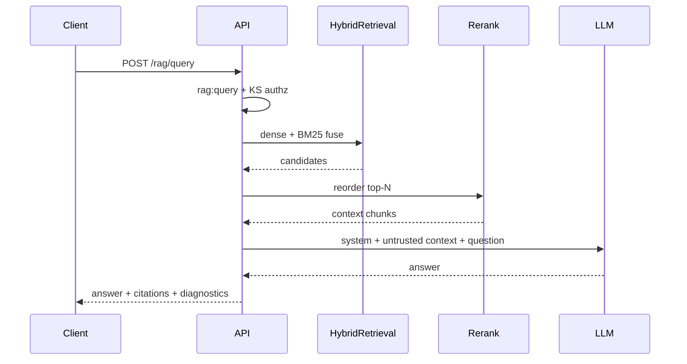

# Architecture overview

ContextForge is implemented as a modular monolith.

## Layer responsibilities

| Layer | Responsibility |
| --- | --- |
| `api` | HTTP routes, request/response schemas, middleware |
| `application` | Use cases, ports, application services |
| `domain` | Entities, domain errors, domain rules |
| `infrastructure` | Database, Redis, Qdrant, MinIO, queue adapters |
| `shared` | Settings, logging, shared utilities |
| `bootstrap` | Application factory and lifespan |
| `workers` | Long-running background processes (ingestion) |

## RAG flow

## Dependency rule

* `domain` depends on nothing outside the domain/shared primitives
* `application` depends on domain and ports
* `infrastructure` implements application ports
* `api` depends on application services via FastAPI dependencies
* `workers` reuse application services and infrastructure adapters

## Timezone policy

All backend timestamps are stored and processed in UTC. User-facing timezone conversion
belongs at presentation boundaries.
